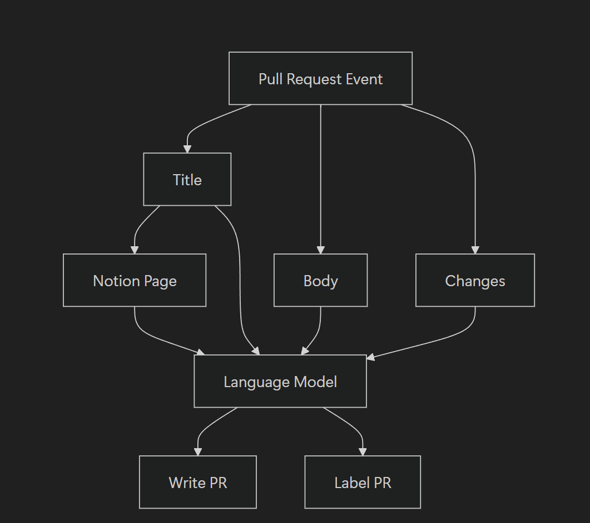

# AI PR Writer with Notion

This project is a tool that automatically generates GitHub Pull Request (PR) descriptions. When a PR is created, it extracts a Notion Unique ID from the PR title, fetches the corresponding Notion page content, analyzes the PR changes, and leverages OpenAI's language model to create a detailed and useful PR body. This enables developers to experience more consistent and efficient PR writing.

---

## How it works



---

## Preqrequisites

1. **OpenAI API Key**  
   - Sign up for an OpenAI account and get an API key.
   - Add the API key as a secret in your GitHub repository.

2. **Notion Github Integration**  
   - Follow this guide to integrate Github into Notion (https://www.notion.com/help/github)
   - Need "Unique ID" for the database (https://www.notion.com/help/github#link-github-prs-to-notion)

---

## Usage

1. **Create a GitHub Workflow**  
In your repository, create a YAML workflow file (e.g., `.github/workflows/ai-pr-writer.yml`) with the following example content:
```yaml
name: AI PR Writer

on:
  pull_request:
    types: [opened, synchronize, reopened]

permissions:
  contents: write
  pull-requests: write

jobs:
  ai-pr-writer:
    name: ai-pr-writer
    runs-on: ubuntu-22.04
    if: ${{ !contains(github.event.pull_request.labels.*.name, 'ai-pr-written') }}
    steps:
      - uses: actions/checkout@v4
        with:
          fetch-depth: 0
      - name: Run AI PR Writer
        uses: team-monolith-product/ai-pr-writer-with-notion@main
        with:
          GITHUB_TOKEN: ${{ secrets.GITHUB_TOKEN }}
          OPENAI_API_KEY: ${{ secrets.OPENAI_API_KEY }}
          PR_NUMBER: ${{ github.event.number }}
          NOTION_TOKEN: ${{ secrets.NOTION_API_KEY }}
          SYSTEM_PROMPT: Always answer in Korean.
          LABEL: ai-pr-written

2. **Set Required Secrets**

In your GitHub repository, navigate to Settings > Secrets and variables > Actions and add the following secrets:

NOTION_TOKEN: Integration key for accessing the Notion API.
OPENAI_API_KEY: API key for accessing OpenAI.


```

## Advanced Usage

AI PR Writer is designed to be used in conjunction with [AI Code Reviewer](https://github.com/team-monolith-product/ai-code-reviewer) to provide a comprehensive automated code review and PR documentation experience. Through AI PR Writer, the planning documents created in Notion are indirectly passed to AI Code Reviewer, enabling high-level code reviews that incorporate the planning details. This integration ensures that code reviews are aligned with the project's objectives and requirements, resulting in more effective and context-aware feedback.

To achieve this integration, your AI Code Reviwer workflow should include the following step:

```yaml
name: AI Code Reviewer

on:
  pull_request:
    types: [opened, synchronize, reopened, ready_for_review, review_requested, labeled]

permissions:
  contents: write
  pull-requests: write

jobs:
  ai-code-reviewer:
    name: ai-code-reviewer
    runs-on: ubuntu-22.04
    if: contains(github.event.pull_request.labels.*.name, 'ai-pr-written')
    steps:
      - uses: actions/checkout@v4
        with:
          fetch-depth: 0
      - name: Run ChatGPT Code Review
        uses: team-monolith-product/ai-code-reviewer@main
        with:
          GITHUB_TOKEN: ${{ secrets.MACHINE_TOKEN }}
          OPENAI_API_KEY: ${{ secrets.OPENAI_API_KEY }}
          PR_NUMBER: ${{ github.event.number }}
          SYSTEM_PROMPT: Always answer in Korean.
```
